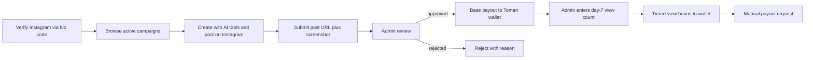

# BananaAI Earn (کسب درآمد) — Feature Guide for Separate Project

Guidance for building a Higgsfield Earn–style creator monetization product for the Iranian market as a **standalone project**. This was prototyped inside BananaAI and then extracted; use this file as the product + technical brief.

## Product concept

Pay creators in **Toman** to make AI-generated promo content with your tools, post it on **Instagram**, and get rewarded after **manual admin review**.

Iran constraints vs Higgsfield:

| Higgsfield | Iran / this design |
|---|---|
| Garna cash payouts | Manual SHEBA/card payout via admin |
| Instagram API / auto metrics | Bio-code verification + screenshot proof; admin enters day-7 views |
| Credits optional | Cash (Toman) wallet only for Earn |
| Multi-platform | Instagram only for v1 |



## User journey

1. **Verify Instagram**
   - User enters handle (normalize: strip `@`, profile URLs).
   - System generates code like `BANANA-4F7K`.
   - User puts code in Instagram bio, then requests review.
   - Admin opens profile, checks bio, approves/rejects.
2. **Browse campaigns**
   - Only `status=active` and not past `deadline`.
   - Show brief, checklist, hashtags/mentions, media kit, base payout, view-bonus tiers, per-video cap.
3. **Submit**
   - Instagram post/reel URL + proof screenshot upload.
   - Requires verified handle; enforce per-campaign submission limit; reject duplicate post URLs.
4. **Get paid**
   - On approve: credit **base** payout to wallet.
   - Status becomes `bonus_pending`.
   - After ~7 days admin enters views; system picks highest matching tier, capped by `maxPayoutPerVideoToman - base`.
   - Status becomes `finalized`.
   - A fixable reject (missing hashtag, etc.) becomes `changes_requested`: one resubmit of the same post, then back to the review queue.
5. **Withdraw**
   - User requests payout with bank/SHEBA note.
   - Min threshold: **500,000 Toman** so one good video can become the first cash-out.
   - Admin pays manually and marks paid/rejected.

## Data models

### EarnCampaign

- `title`, `brief`
- `requirementsChecklist: string[]`
- `requiredHashtags: string[]`, `requiredMentions: string[]`
- `minVideoLengthSeconds`
- `mediaKitUrls: string[]`
- `basePayoutToman`
- `viewBonusTiers: { minViews, bonusToman }[]` (sorted ascending by views)
- `maxPayoutPerVideoToman` (must be ≥ base)
- `maxSubmissionsPerUser` (default 3)
- `totalBudgetToman`, `spentBudgetToman`
- `deadline: Date | null`
- `status: draft | active | paused | ended`
- `createdBy`, timestamps

Indexes: `{ status, deadline }`, `{ createdAt: -1 }`

### EarnSubmission

- `userId`, `campaignId`
- `instagramPostUrl`, `proofScreenshotUrl`
- `status: pending | approved | rejected | bonus_pending | finalized`
- `reviewerNote`, `reviewedBy`, `reviewedAt`
- `basePayoutToman`, `basePaidAt`
- `day7Views`, `bonusToman`, `bonusPaidAt`
- `finalizedAt`, timestamps

Indexes: `{ status, createdAt }`, `{ userId, campaignId }`, `{ campaignId, status }`

Suggested flow statuses:

- `pending` → admin queue
- `approve` → set `bonus_pending` + credit base
- `reject` with `allowResubmit` (default true) → `changes_requested` (one fix: same post, new screenshot)
- second reject, or `allowResubmit: false` (fraud / wrong content) → `rejected` (dead end; frees the campaign slot)
- `enter_views` → compute bonus, credit, set `finalized`

### User / creator verification fields

- `earnInstagramHandle` (unique when set; lowercase)
- `earnVerificationCode`
- `earnVerificationStatus: none | pending | verified | rejected`
- `earnVerifiedAt`, `earnVerificationRequestedAt`, `earnVerificationNote`

Review SLA: **48 hours**. Show the exact due time in the UI (`بررسی حداکثر ۴۸ ساعت` + result-by datetime). Admin queues sort oldest-first and highlight overdue items. Uncertainty about when is worse than the wait.

Partial unique index on handle so one Instagram account cannot monetize under two users.

### Wallet

Use a dedicated **Earn wallet** in the new project (cleaner than sharing a referral wallet):

- `earnWalletBalance`
- `earnWalletLifetimeEarned`
- `earnWalletLifetimePaidOut`

Plus a `EarnPayout` collection (`pending | paid | rejected`) with bank note.

In BananaAI prototype, earnings were temporarily credited to `referralWalletBalance` to reuse existing payout UI. **Do not copy that coupling** into the separate product.

## Bonus calculation

```ts
function computeViewBonusToman(
  views: number,
  tiers: { minViews: number; bonusToman: number }[],
  maxPayoutPerVideoToman: number,
  basePayoutToman: number
): number {
  const sorted = [...tiers].sort((a, b) => a.minViews - b.minViews);
  let bonus = 0;
  for (const tier of sorted) {
    if (views >= tier.minViews) bonus = tier.bonusToman;
  }
  const remainingCap = Math.max(0, maxPayoutPerVideoToman - basePayoutToman);
  return Math.min(bonus, remainingCap);
}
```

Also enforce campaign budget: refuse approve / enter_views if `spent + amount > totalBudget` (when totalBudget > 0). Remaining budget (`total - spent`) is shown publicly on campaign cards to create urgency.

## Recommended campaign economics

| Knob | Range / default | Why |
|---|---|---|
| Base payout | 300,000–500,000 (default 400,000) | Floor worth the effort even before bonuses |
| View tiers | 1k → +100k, 5k → +300k, 20k → +1M | Highest matching tier; 1M is the dream to chase |
| Cap per video | 1.5–2M (default 2,000,000) | So the 20k / +1M bonus actually pays out |
| Min withdrawal | 500,000 | One good video = first cash-out |
| Campaign budget | 10–20M (default 15,000,000) | Scarcity; remaining budget is public |

## APIs (suggested)

### User

| Method | Path | Purpose |
|---|---|---|
| GET/POST | `/api/user/earn/verification` | GET status; POST `action=start` (handle→code) or `request_review` |
| GET | `/api/user/earn/campaigns` | Active campaigns |
| GET/POST | `/api/user/earn/submissions` | List mine / create submission |
| POST | `/api/user/earn/payout-request` | Withdraw from earn wallet |

### Admin

| Method | Path | Purpose |
|---|---|---|
| GET/POST | `/api/admin/earn/campaigns` | List / create |
| PATCH | `/api/admin/earn/campaigns/:id` | Update + status toggle |
| GET | `/api/admin/earn/verifications?status=` | Pending Instagram checks |
| PATCH | `/api/admin/earn/verifications/:userId` | `decision=approve\|reject` |
| GET | `/api/admin/earn/submissions?status=` | `review` / `day7` / filters |
| PATCH | `/api/admin/earn/submissions/:id` | `approve` / `reject` / `enter_views` |

## UI surfaces

### User dashboard `/earn` (Persian RTL)

- Wallet summary (available / lifetime / paid out)
- Verification card (handle, code copy, request review)
- Expandable campaign list + submit form (URL + screenshot)
- My submissions with status badges and amounts
- Payout request form (min amount + SHEBA/card)

### Admin `/admin/earn`

Tabs:

1. **Campaigns** — create form (brief, tiers, budget, deadline), activate/pause/end
2. **Verifications** — open Instagram profile link, approve/reject
3. **Submissions** — open post + screenshot; approve base; day-7 view entry

All user-facing copy: Persian, RTL, **no em dashes** (`—`).

## Validation helpers

- Normalize Instagram handle: trim, strip `@`, strip `instagram.com/` paths.
- Handle regex: `/^[a-z0-9._]{2,30}$/i`
- Post URL: host `instagram.com`, path `/p|reel|reels|tv/{id}`
- Profile URL for admin: `https://www.instagram.com/{handle}/`
- Verification code alphabet: avoid ambiguous chars (`I`, `O`, `0`, `1`)

## Anti-fraud (v1)

- One verified handle per user (unique index)
- Verification required before submit
- Per-campaign submission cap
- Per-video payout cap
- Duplicate post URL rejected
- Budget cap on campaign spend
- Manual payout only (admin sees bank details)
- Optional later: clawback before payout if fraud suspected

## Stack notes (BananaAI context, optional reuse)

If building near BananaAI patterns:

- Next.js App Router, MongoDB + Mongoose
- NextAuth mobile OTP auth
- S3 image upload for proof screenshots (`/api/upload/image`)
- Admin gate via existing admin role helpers
- Zarinpal is **inbound only**; Earn payouts stay manual

**Client safety:** never import server Mongoose modules into `"use client"` pages. Keep constants (e.g. min payout) in a client-safe module.

## Out of scope for v1

- Automated Instagram scraping / view APIs
- YouTube / Telegram / Aparat
- Automated bank payouts
- Real-time public earnings counters
- Paying in platform credits instead of Toman (possible later as hybrid)

## Suggested MVP build order

1. Models + wallet credit helper
2. User verification + admin verification queue
3. Campaign CRUD + public active list
4. Submission create + admin review (base payout)
5. Day-7 view entry + bonus
6. Payout request + admin pay/reject UI
7. Nav, empty states, Persian copy polish

## Example campaign defaults (starting point)

- Base: 100,000 Toman
- Tier 1: 1,000 views → 50,000
- Tier 2: 5,000 views → 150,000
- Max per video: 500,000
- Budget: 5,000,000
- Max submissions/user: 3

Tune per campaign; rates are product decisions, not engineering.

## Reference inspiration

Higgsfield Earn (`creators.higgsfield.ai`): campaign briefs, bio verification, base + performance bonuses. Adapt mechanics above for Iran (manual verification, Toman, Instagram-only).
